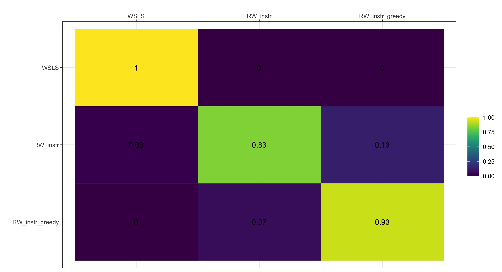

# Model Fitting


```{r}

rm(list=ls())

library(dplyr)
library(ggplot2)
library(gridExtra) # for plotting
library(ggpubr)
library(reshape2)

source("simulation_functions/simulate_RW_instr.R")
source("simulation_functions/simulate_RW_instr.R")
source("likelihood_functions/likelihood_RW_instr.R")
source("likelihood_functions/likelihood_WSLS.R")
source("likelihood_functions/likelihood_RW_instr_greedy.R")

source("helper_functions/greedy.R")
source("helper_functions/fit_model.R")
source("helper_functions/softmax.R")
source("helper_functions/chooseBinomial.R")
source("helper_functions/BICcompute.R")
source("helper_functions/softmax.R")

```


## Parameter recovery

```{r, parameter recovery}
# Define the parameters
sims<-30
#n_param<-10# number of simulations
alpha_bound<-c(0,1) # Boundary of the alpha
beta_bound<-c(0, 40) # Boundaries of the beta

# generate a number of randomparameters
alpha_seq<-seq(alpha_bound[1], alpha_bound[2], length.out = sims)
beta_seq<-seq(beta_bound[1], beta_bound[2], length.out = sims)
# randomly shuffle them
alpha_seq<-sample(alpha_seq)
beta_seq<-sample(beta_seq)

# create a structure for the dataframe
nTrials<-100
p_red<-0.70

df<-data.frame("t" = 1:nTrials)
df$win <- sample(c("red", "yellow"), size = nTrials, prob = c(p_red, 1-p_red),
                 replace =T)

# create an empty dataframe
sim_all<-as.data.frame(matrix(NA, nrow = sims, ncol = 4))

# set the progress bar
#pb<-txtProgressBar(min=0, max=sims, style =3)

# loop through the simulations
for(s in 1:sims){
  
  # advance progress bar
  #setTxtProgressBar(pb, s) 
  
  # simulate
  simulated<-simulate_RW_instr(df, alpha = alpha_seq[s], beta = beta_seq[s])
  
  # reduce it
  simulated<-simulated %>% select(c("t","choice_slot" ,"r" ))
  
  model<- "RW_instr"
  
  # fit the model
  fit<-fit_model(simulated, alphaBound = alpha_bound, betaBound = beta_bound, 
                 model = model)
  
  fit_alpha<-fit$alpha_beta[1]
  fit_beta<-fit$alpha_beta[2]
  
  sim_all[s, ]<-c(alpha_seq[s], fit_alpha, beta_seq[s], fit_beta)
  
}

# assign names
names(sim_all)<-c("sim_alpha", "fit_alpha", "sim_beta", "fit_beta")

plotalpha<-ggplot(sim_all, aes(x=sim_alpha, y=fit_alpha)) + 
  geom_point()+
  geom_smooth(method=lm)+
  theme_bw()+
  stat_cor(method="pearson")+
  xlim(0,1)+
  ylim(0,1)+
  #stat_cor(method = "pearson", label.x = 3, label.y = 30)+
  ggtitle("Alpha parameter")

plotbeta<-ggplot(sim_all, aes(x=sim_beta, y=fit_beta)) + 
  geom_point()+
  geom_smooth(method=lm)+
  theme_bw()+
  stat_cor(method="pearson")+
  xlim(0,40)+
  ylim(0,40)+
  #stat_cor(method = "pearson", label.x = 3, label.y = 30)+
  ggtitle("Beta parameter")

g<-grid.arrange(plotalpha, plotbeta, ncol=2)


```


### rerun the parameter recovery by limiting the beta to 10
```{r, parameter recovery 2}

# Define the parameters
sims<-30

#n_param<-10# number of simulations
alpha_bound<-c(0,1) # Boundary of the alpha
beta_bound<-c(0, 10) # Boundaries of the beta

# generate a number of randomparameters
alpha_seq<-seq(alpha_bound[1], alpha_bound[2], length.out = sims)
beta_seq<-seq(beta_bound[1], beta_bound[2], length.out = sims)

# randomly shuffle them
alpha_seq<-sample(alpha_seq)
beta_seq<-sample(beta_seq)

# create a structure for the dataframe
nTrials<-100
p_red<-0.70

df<-data.frame("t" = 1:nTrials)
df$win <- sample(c("red", "yellow"), size = nTrials, prob = c(p_red, 1-p_red),
                 replace =T)

# create an empty dataframe
sim_all<-as.data.frame(matrix(NA, nrow = sims, ncol = 4))

# set the progress bar
#pb<-txtProgressBar(min=0, max=sims, style =3)

# loop through the simulations
for(s in 1:sims){
  
  # advance progress bar
  #setTxtProgressBar(pb, s) 
  
  # simulate
  simulated<-simulate_RW_instr(df, alpha = alpha_seq[s], beta = beta_seq[s])
  
  # reduce it
  simulated<-simulated %>% select(c("t","choice_slot" ,"r" ))
  
  # fit the model
  fit<-fit_model(simulated, alphaBound = alpha_bound, betaBound = beta_bound, 
                 model = "RW_instr")
  
  fit_alpha<-fit$alpha_beta[1]
  fit_beta<-fit$alpha_beta[2]
  
  sim_all[s, ]<-c(alpha_seq[s], fit_alpha, beta_seq[s], fit_beta)
  
}

# assign names
names(sim_all)<-c("sim_alpha", "fit_alpha", "sim_beta", "fit_beta")

plotalpha<-ggplot(sim_all, aes(x=sim_alpha, y=fit_alpha)) + 
  geom_point()+
  geom_smooth(method=lm)+
  theme_bw()+
  stat_cor(method="pearson")+
  xlim(0,1)+
  ylim(0,1)+
  #stat_cor(method = "pearson", label.x = 3, label.y = 30)+
  ggtitle("Alpha parameter")

plotbeta<-ggplot(sim_all, aes(x=sim_beta, y=fit_beta)) + 
  geom_point()+
  geom_smooth(method=lm)+
  theme_bw()+
  stat_cor(method="pearson")+
  xlim(0,beta_bound[2])+
  ylim(0,beta_bound[2])+
  #stat_cor(method = "pearson", label.x = 3, label.y = 30)+
  ggtitle("Beta parameter")

g<-grid.arrange(plotalpha, plotbeta, ncol=2)

```
## Model recovery



## Fit model to data 
First, for one participant only, one model

```{r, model fit one participant}

# import data for the first participant
p1<-read.csv("Data/1.csv")

models<-c("WSLS", "RW_instr_greedy", "RW_instr")

# fit the three models and save the BIC
# BIC<-fit_model(df =  , alphaBound = , betaBound =  ,
#                model = )[[3]]


```

## Now, fit different models and get the BIC
```{r, model fit one participant different BIC}
#
# import data for the first participant
p1<-read.csv("Data/1.csv")

models<-c("WSLS", "RW_instr_greedy", "RW_instr")

# fit the three models and save the BIC
BIC<-vector()
for (mod in 1: length(models)){
  BIC[mod]<-fit_model(df = p1 , alphaBound = c(0,1) , betaBound = c(0,10) ,
                      model = models[mod])[[3]]
}


```

## Now run for all participants
```{r, model fit all participants}

if (!file.exists("output_files/model_comparison.Rdata")){  # if the file is not present
  
  # how many participants do we have?
  all_part<-list.files("Data")
  
  n_part<-length(all_part)
  
  # we want to save the BIC for each model for each participant
  data_comp<-as.data.frame(matrix( nrow = n_part, ncol = 6))
  names(data_comp)<-c("participant", "BIC_WSLS", "RW_instr_greedy", 
                      "RW_instr", "alpha", "beta")
  
  pb<-txtProgressBar(min=0, max=n_part, style =3)
  
  # loop through participants
  for (part in 1: n_part){
    
    setTxtProgressBar(pb, part) 
    # read the file
    curr_part<-read.csv(paste0("Data/",all_part[part]))
    
    BIC<-vector()
    
    for (mod in 1: length(models)){
      
      BIC[mod]<-fit_model(df = curr_part , alphaBound = c(0,1) , betaBound = c(0,5) ,
                          model = models[mod])[[3]]
    }
    
    alphabeta<-fit_model(df = curr_part , alphaBound = c(0,1) , betaBound = c(0,5) ,
                         model = "RW_instr")[[1]]
    # assign to dataset
    data_comp[part,]<-c(part, BIC, alphabeta[1], alphabeta[2])
    
  }
  
  save(data_comp, file = "output_files/model_comparison.Rdata")
  
} else { # if the file exists, load the data
  
  load(file = "output_files/model_comparison.Rdata")
  
}


```

## Get descriptive BIC by model
```{r echo=TRUE}
# descriptive bic
colMeans(data_comp[,2:4]) 


```

## Compare the models
```{r model comparison, warning=FALSE}

# Initialize variables
data_comp$BestModel<-NA
data_comp$SecondBest<-NA
for (j in 1: nrow(data_comp)){
  tryCatch({

    index<-which(data_comp[j,]==min(data_comp[j,2:4]))
    
    index2<-which(data_comp[j,]==as.numeric(sort(data_comp[j,2:4]))[2])
    
    if (length(index)>1) {# fi there are more than one model
      
      data_comp$BestModel[j]<-NA
      
      data_comp$SecondBest[j]<-NA
      
    }else{
      data_comp$BestModel[j]<-names(data_comp[index])
      
      data_comp$SecondBest[j]<-names(data_comp[index2])
      
    }
    
  }, error = function(e) { print(paste("problem with number", j))}) 
}

# create difference between the best model and the second best
data_comp$BestModelBIC<-NA

data_comp$SecondBestModelBIC<-NA

for (n in 1: nrow(data_comp)){
  tryCatch({
    data_comp$BestModelBIC[n]<-data_comp[n,data_comp$BestModel[n]]
    data_comp$SecondBestModelBIC[n]<-data_comp[n,data_comp$SecondBest[n]]
  }, error=function(e){}
  )
}

# create the difference between the two
data_comp$BicDiff<-data_comp$SecondBestModelBIC -data_comp$BestModelBIC

# create the evidence
data_comp$evidence<-NA
for (n in 1: nrow(data_comp)){
  tryCatch({
    
    if(data_comp$BicDiff[n]>10){
      data_comp$evidence[n]<-"very strong"
      
    } else if (data_comp$BicDiff[n]<10 & (data_comp$BicDiff[n]>=6)){
      data_comp$evidence[n]<-"strong"
      
    }else if ( data_comp$BicDiff[n]<6 & (data_comp$BicDiff[n]>=2)){
      data_comp$evidence[n]<-"positive"
      
    } else{
      data_comp$evidence[n]<-"weak"
      
    }
    
  }, error=function(e){}
  )
  
}

# now long
data_comp_all<-melt(data_comp[, c("participant", "BestModel", "evidence")],
                    id.vars = c("participant", "BestModel" ))

names(data_comp_all)[4]<-"evidence"

data_comp_all$evidence<-as.factor(data_comp_all$evidence)
data_comp_all$evidence<-factor(data_comp_all$evidence,
                    levels =c("very strong", "strong", "positive", "weak") )

# reorder the levels (models)
data_comp_all$BestModel<-factor(data_comp_all$BestModel, levels =models)

# exclude NAs
data_comp_all_exc<-data_comp_all[complete.cases(data_comp_all$BestModel), ]

# plot
data_comp_all_exc %>%
  mutate(BestModel = factor(BestModel, 
                            levels= models)) %>%
    ggplot( aes( x=BestModel, fill = evidence)) + 
  geom_bar(position="stack", stat="count")+
  ylab("Participants")+
  coord_flip()+
  theme_classic()+
  theme(
    plot.title = element_text(size = 22),
    axis.title.x = element_text(size = 20),
    axis.title.y = element_text(size = 20),
    axis.text=element_text(size=20),
  )+
  scale_fill_viridis_d()


print(# count best model
  Best<- data_comp_all_exc %>%
    dplyr::count(BestModel)
)

print(
  strong<- data_comp_all_exc %>%
    group_by(BestModel) %>%
    dplyr:: count(evidence)
)
```


